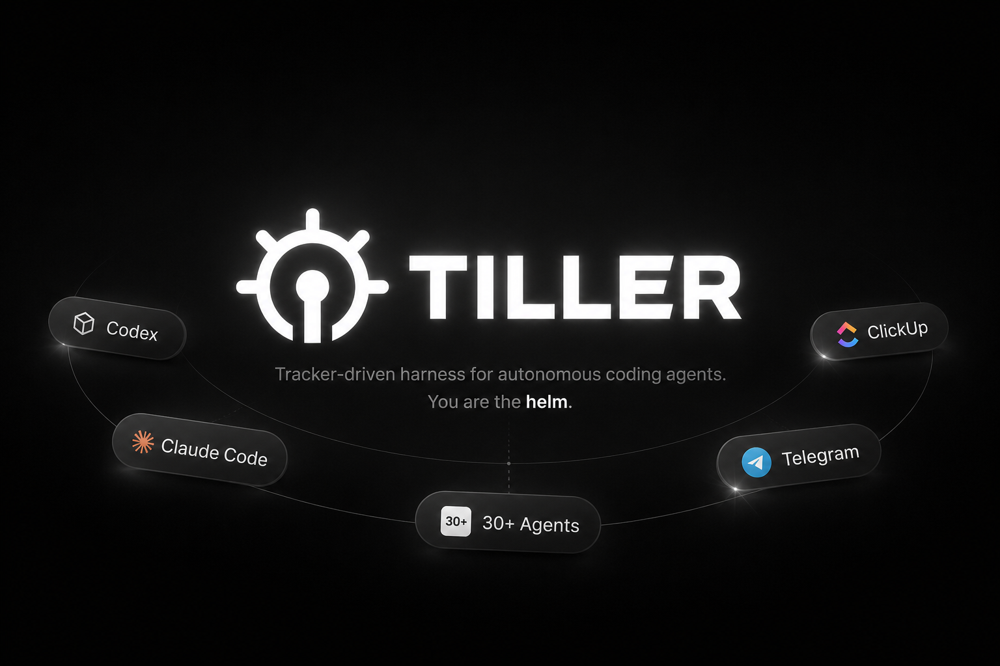
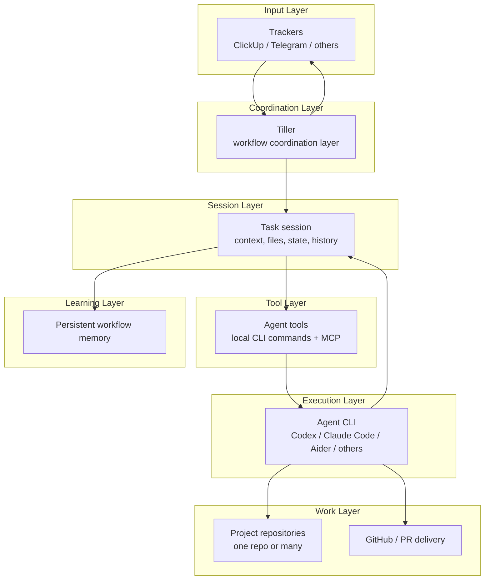

<p align="center">
  
</p>

<p align="center">
  <a href="#quick-install"><strong>Quick install</strong></a>
</p>

# Tiller

**Tracker-driven harness for autonomous coding agents.**

*Tiller is a simple, tracker-agnostic workflow layer that connects coding agents to real engineering workflows. It provides everything agents need to execute engineering work end-to-end — from task understanding to pull request delivery — with tracker awareness, multi-repo coordination, and persistent workflow memory that compounds over time. No heavy workflows, orchestration engines, or rigid process definitions. Just the minimum necessary structure to achieve maximum execution performance.*

Tiller watches your tracker, finds the work to be done, opens an isolated session, starts the selected coding-agent CLI, gives it the right context, and lets the agent work like a developer.

Example: Move a task from ClickUp to Develop and Tiller starts Codex/Claude in a new workspace with the task's context. The agent publishes progress and reports blocks, works on the repositories needed to complete the task, and opens pull requests in all repositories worked on.

**Your agent is treated like a developer. You are the helm.**

Tiller is built on a simple philosophy: no workflows, no orchestration, no rigidity.
It provides only the minimum structure needed for the agent to achieve maximum performance: clean context, the right tools, and room to work.

Tiller can keep durable memory so the agent gradually understands:
- your preferences
- your product and business context
- the rules and conventions of each repository
- historical decisions that should not be rediscovered every time

That means the more you use Tiller, the more context the agent can carry forward across tasks.

---

## Supported today

### Agent CLIs

Tiller currently ships with **41 built-in agent adapters**.

Core adapters:
- `codex`
- `claude-code`
- `opencode`
- `aider`
- `gemini-cli`

Additional built-in adapters include:
- `aichat`, `amp`, `auggie`, `autohand`, `charm`, `cline`, `cloudflare_agents`
- `codebuff`, `cody`, `composio`, `continue_dev`, `copilot`, `cursor`
- `devin_terminal`, `droid`, `forge`, `goose`, `gptme`, `hermes`, `iac`
- `junie`, `kilo`, `kimi`, `kiro`, `letta_code`, `mistral`, `ollama`
- `openai_agents`, `openhands`, `open_interpreter`, `pi`, `plandex`
- `q_dev`, `qwen`, `ralphex`, `rovo`

You can also add custom CLI adapters with `agents.json`.

### Trackers

Supported now: `clickup`, `telegram`, and `memory` for local development/tests.

Planned/reserved: `trello`, `linear`, `github`, and `github-issues`.

---

## What Tiller does

Capability | What it means
--- | ---
Tracker watcher | Polls the configured tracker status and starts work only when a task is ready.
Isolated sessions | Creates a per-task workspace with task files, memory, attachments, config, and repo area.
Agent CLI launcher | Starts the selected coding-agent CLI with the task goal in the session workspace.
Project-local MCP bootstrap | Prepares MCP config files for supported agent CLIs inside the session workspace.
Local Tiller commands | Gives the agent a universal interface to read tasks, comment, request repos, inspect session state, and work with GitHub.
GitHub integration | Uses local `tiller github ...` commands backed by the GitHub REST API for auth checks, repo checks, and PR creation.
Durable memory | Lets the agent keep useful context across tasks, including user preferences, business rules, product knowledge, and repo conventions.
Session memory | Keeps `STATE.md` and session metadata so paused work can resume with context.
Repo provisioning | Lets the agent request configured repos and receive an isolated repo copy inside its session.

> The agent is the developer, not the workflow engine.

---

## Quick install

Install Tiller with the platform bootstrap script.

### Linux / macOS

```bash
curl -fsSL https://raw.githubusercontent.com/joaotolovi/Tiller/master/installers/bootstrap.sh | sh
```

### Windows (PowerShell)

```powershell
irm https://raw.githubusercontent.com/joaotolovi/Tiller/master/installers/bootstrap.ps1 | iex
```

The bootstrap script will:

- download the current Tiller package via `codeload.github.com`
- execute the real platform installer from inside that package
- preserve interactive setup on Unix even when using `curl ... | sh` by reading from `/dev/tty` when available

The full installer will then:

- install `uv` if needed
- download the Tiller source code into a standard local install directory
- sync project dependencies
- run the guided setup when the config file does not exist yet
- register Tiller to run in the background for your OS

Installer modes:

- `install` — fresh install only; if Tiller is already installed and a terminal is available, the installer will ask whether you want to `upgrade`, `reinstall`, `uninstall`, or `cancel`
- `upgrade` — requires an existing installation and updates it in place
- `reinstall` — force reinstall in place
- `uninstall` — removes the installed app and service, preserving config/logs


Default locations:

- Linux
  - install dir: `~/.local/share/tiller`
  - config: `~/.config/tiller/tiller.yaml`
  - logs: `~/.local/state/tiller/logs`
- macOS
  - install dir: `~/.local/share/tiller`
  - config: `~/.config/tiller/tiller.yaml`
  - logs: `~/.local/state/tiller/logs`
- Windows
  - install dir: `%LOCALAPPDATA%\Tiller`
  - config: `%APPDATA%\Tiller\tiller.yaml`
  - logs: `%LOCALAPPDATA%\Tiller\logs`

You can override these paths with installer variables/parameters if needed.

---

## Getting started

### 1. Run the guided setup

```bash
uv run tiller setup
```

The setup wizard helps you choose:

- default agent CLI discovered in your `PATH`
- optional model for that CLI
- tracker provider
- ClickUp workspace, trigger status, and optional filters
- Telegram bot token, local state path, and optional chat/user filters
- GitHub access settings
- project repositories
- session cleanup behavior

### 2. Review `tiller.yaml`

```yaml
tracker:
  type: clickup
  token: YOUR_CLICKUP_TOKEN
  team_id: "YOUR_CLICKUP_TEAM_ID"
  trigger_status: AIDEV
  poll_interval: 60
  # assignee: "CLICKUP_USER_ID"
  # tag: backend

agent:
  default: codex
  model: gpt-5

github:
  enabled: true
  url: https://api.github.com
  token_env: GITHUB_API_TOKEN
  # token: github_pat_xxx

projects:
  backend:
    url: https://github.com/your-org/backend
    default_branch: main

session:
  base_path: ~/.tiller/sessions
  cleanup_after_hours: 24
  keep_finished_sessions: true
```

### 3. Memory: help the agent learn your context

Tiller can keep durable memory so the agent improves over time instead of relearning the same context on every task.

This is useful for things like:
- user preferences
- repository-specific conventions
- business logic
- product knowledge
- historical context worth preserving

### Local memory

By default, memory is simple and local.

You can enable it in `tiller.yaml`:

```yaml
memory:
  enabled: true
  provider: local
  base_path: ~/.tiller/memory
```

With the local provider, Tiller points the agent to a persistent memory directory and instructs it to:
- read from that directory when useful
- write durable knowledge as Markdown (`.md`) files
- organize the files in the simplest way that makes sense

This keeps memory:
- easy for agents to use
- easy for humans to inspect and edit
- independent from MCP or special memory commands

### Optional advanced memory providers

Default install stays light:

```bash
uv sync
```

If you want the embedded Hindsight provider:

```bash
uv sync --extra memory-hindsight
```

If you want the LangMem provider:

```bash
uv sync --extra memory-langmem
```

Then set `memory.provider: hindsight` or `memory.provider: langmem` in `tiller.yaml` and configure the LLM fields under `memory:`.

### 4. Check which agent CLIs are available

```bash
uv run tiller discover-agents --config tiller.yaml
```

### 5. Start the service

```bash
uv run tiller run --config tiller.yaml
```

Tiller will keep polling the tracker. When a task reaches `trigger_status`, it creates a session and starts the configured agent.

---


## Architecture



---

## CLI quick reference

Command | Purpose
--- | ---
`uv run tiller setup` | Interactive setup wizard.
`uv run tiller discover-agents --config tiller.yaml` | Lists built-in/custom agent adapters and whether their commands exist in `PATH`.
`uv run tiller run --config tiller.yaml` | Starts the tracker watcher service.
`uv run tiller tracker get-task` | Reads the current task from inside a session.
`uv run tiller tracker comment "..."` | Adds a tracker comment from inside a session.
`uv run tiller project list` | Lists configured projects from inside a session.
`uv run tiller project use backend --reason "..."` | Provisions a repo copy into the current session.
`uv run tiller github auth-status` | Verifies GitHub API access for the current session.
`uv run tiller github create-pr --repo backend --title "..." --body-file pr.md` | Opens a PR through the GitHub REST API.
`uv run tiller session status` | Shows the current session state.

For local memory, the agent uses the configured memory directory directly.
It reads and writes Markdown memories there instead of using dedicated memory CLI commands.

If you use advanced providers such as Hindsight or LangMem, configure them under `memory:` in `tiller.yaml`.

---

## How it works

1. Tiller polls the configured tracker for tasks in `trigger_status`.
2. For each ready task, it creates or resumes an isolated session.
3. The session receives task context, attachments, project metadata, `AGENTS.md`, `TASK.md`, `task.json`, and `STATE.md`.
4. Tiller starts the configured agent CLI in that workspace.
5. The agent uses local `tiller ...` commands to inspect the task, comment progress, request repos, and inspect session state.
6. Repositories are provisioned as isolated session-local repo copies under the session when requested.
7. Human-facing progress stays in the tracker; implementation work stays in the repo/PR flow.

---

## Session layout

Each tracker task gets a workspace similar to:

```text
~/.tiller/sessions/<task-session>/
├── AGENTS.md
├── TASK.md
├── task.json
├── STATE.md
├── projects.json
├── session.json
├── .mcp/
│   └── config.json
├── .codex/
│   └── config.toml
├── .gemini/
│   └── settings.json
├── .cursor/
│   └── mcp.json
├── attachments/
└── repos/
    └── <project-repo>/
```

Depending on the selected adapter, Tiller may also write agent-specific MCP project files such as `.mcp.json`, `opencode.json`, `.continue/mcpServers/tiller.yaml`, `.augment/settings.json`, `.factory/mcp.json`, `gptme.toml`, or `mcp.json`.

The agent starts inside this workspace. It can read the task context immediately and use local `tiller` commands for tracker, project, and session operations.

If local memory is enabled, the agent also receives a persistent memory directory path in `AGENTS.md` and can read/write Markdown memories there as needed.

---

## Local commands used by agents

Command | Purpose
--- | ---
`tiller tracker get-task` | Read current task details, description, comments, and attachments.
`tiller tracker comment "..."` | Leave progress notes, blockers, PR links, or summaries on the tracker task.
`tiller tracker set-status <status>` | Move the tracker task when the agent intentionally decides to do so.
`tiller tracker download-attachments` | Download task attachments into the session workspace.
`tiller project list` | List configured repositories available to the task.
`tiller project status` | Show which configured repositories are already provisioned in the session.
`tiller project use <name> --reason "..."` | Request and provision a repository copy for implementation.
`tiller github auth-status` | Verify that GitHub API access is available.
`tiller github repo-status <repo>` | Inspect the GitHub repository tied to a configured project.
`tiller github create-pr --repo <name> --title "..." --body-file <path>` | Open a PR for a provisioned repository through the GitHub REST API.
`tiller github pr-view --repo <name> --number <n>` | Inspect an existing pull request.
`tiller session status` | Inspect current session state.
`tiller session paths` | Show important files and directories in the session.

`STATE.md` is the continuity layer between runs.

---

## Design principles

- **Agent-first** — the agent decides how to solve the task.
- **Tracker-driven** — the tracker remains the source of truth for ready work and human-visible progress.
- **Minimal harness** — Tiller starts sessions, passes context, and stays out of the way.
- **CLI-agnostic** — use Codex, Claude Code, OpenCode, Aider, Gemini CLI, or a custom adapter.
- **Repo-safe** — implementation happens in isolated session repo copies instead of dirtying shared checkouts.
- **Clean per-task environment** — no git worktree management; each task gets its own clean repo copy to work in.

---

## Current status

Implemented:

- ClickUp watcher loop
- in-memory tracker for local/dev testing
- guided setup
- 41 built-in agent adapters
- custom CLI adapters through `agents.json`
- isolated session creation and resume
- project-local MCP bootstrap for supported agent CLIs
- local tracker/project/session commands
- optional GitHub integration through local `tiller github ...` commands backed by the REST API
- repo provisioning with session-local seed clones and repo copies
- session memory with `STATE.md`
- durable memory with a simple local Markdown directory
- optional advanced memory providers (`hindsight`, `langmem`)

Planned/evolving:

- more tracker adapters
- more production hardening
- deeper end-to-end validation across real agent CLIs

---

## Troubleshooting

Problem | Check
--- | ---
No agent is discovered | Install one of the supported CLIs and make sure the command is in `PATH`.
`Unknown agent adapter` | Confirm `agent.default` matches a built-in adapter or a custom adapter in `agents.json`.
ClickUp auth fails | Verify `tracker.token`, `tracker.team_id`, and ClickUp API access.
No tasks are picked up | Confirm the exact `trigger_status`, optional `assignee`/`tag` filters, and `poll_interval`.
GitHub access is unavailable | Confirm `github.enabled`, `github.url`, and `GITHUB_API_TOKEN` or `github.token`.
Repo provisioning fails | Verify the project URL, permissions, default branch, and local git access.

---

**Less orchestration. More agency. Minimum mechanism, maximum leverage.**
